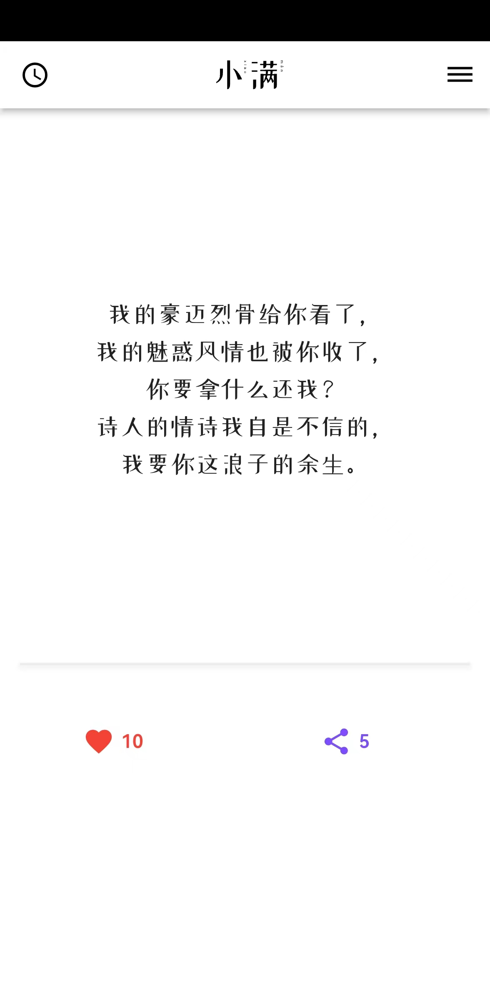
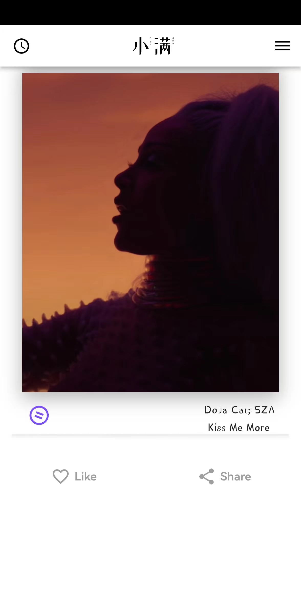

# 小满 - 月圆则缺，水满则溢，小满为盈，大满为亏

## Table of Contents
- [项目简介](#introduction)
- [Features](#features)
- [Installation](#installation)
- [Usage](#usage)
- [Contributing](#contributing)
- [License](#license)
- [Contact](#contact)

## 项目简介
这个项目是一个情怀项目，大学的时候特别喜欢的一个APP，叫“柴扉”，每天分享一首诗、一支歌、一篇文。个人非常喜欢。看着这个APP从免费，到会员8块、12块、25块，再到倒闭停运。说实话真的觉得蛮可惜。现在虽然也有类似的APP，比如“句读”、“一个”等，除了这三个模式，还增加了社区分享的功能，说实话，有人的地方注定就不平静。既然找不回原来的感觉，那么这个项目也就应运而生，作为一个公开项目、服务器用的自己的私人服务器，不以盈利为目的、纯属为爱发电。如果有志同道合的小伙伴，欢迎合作开发。

## APP
- 
- 
- 
- 

## Installation
Describe the steps to install the application:
1. Clone the repository: `git clone https://github.com/yourusername/xiaoman_application_remake.git`
2. Install dependencies: `flutter run`

## License
This project is licensed under the MIT License - see the LICENSE file for details.

## Contact
Provide contact information for the project maintainers:
- Name: Bonoy
- Email: wben65388@gmail.com
- GitHub: [Bonoy0328](https://github.com/Bonoy0328)

